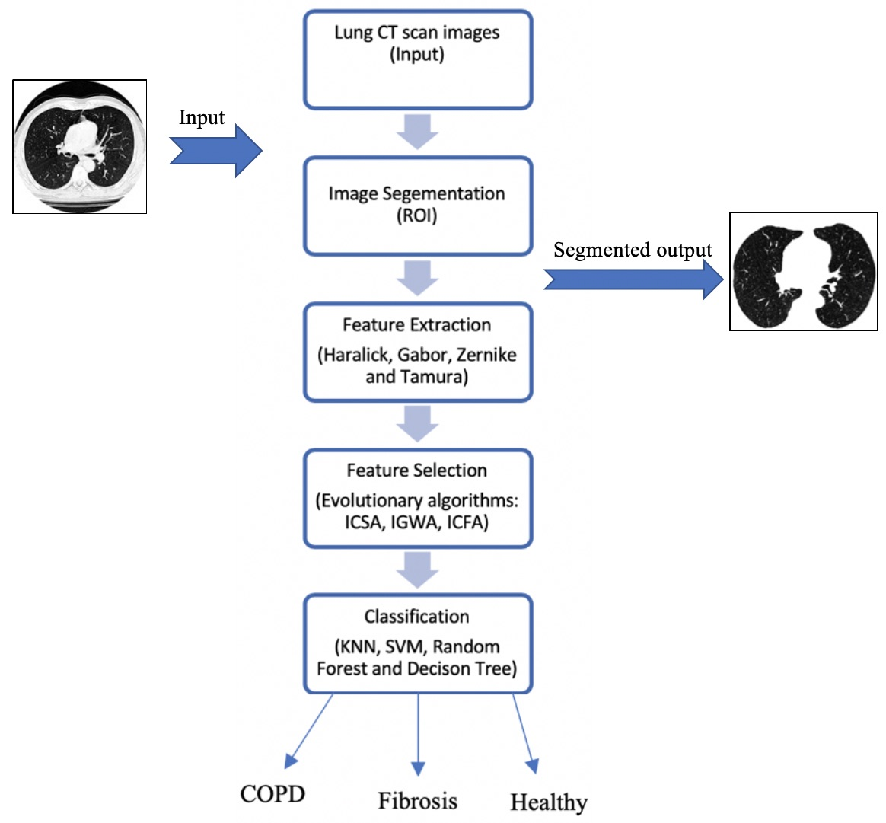
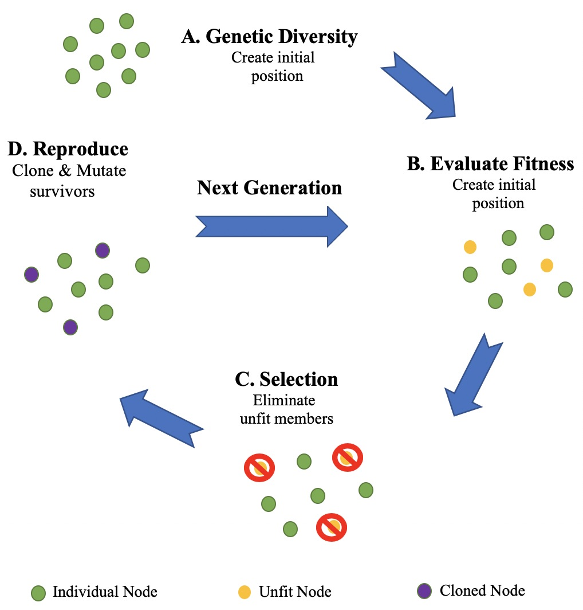

# Image-Processing-Lung-disease-detection-using-feature-selection-and-machine-learning
A Computer Aided Diagnosis (CAD) system to diagnose lung diseases: COPD and Pulmonary Fibrosis using chest CT images.
  - Image segmentation was done by getting active contour and creating binary mask image.
  - Features extracted are : Zenrike, Haralick, Gabor and Tamura (total 111 image descriptors)
  - Bio-inspired evolutionary algorithms : Crow Search, Grey Wolf and Cuttlefish algorithms were used for feature selection.
  - Classifiers used : SVM (Linear kernel), KNN, Random forest and Decision tree.
  - 99.2% accuracy achieved.

### Proposed CAD System:

### Lung Segmentation:

### Feature Selection - Evolutionary Algorithm cycle:

